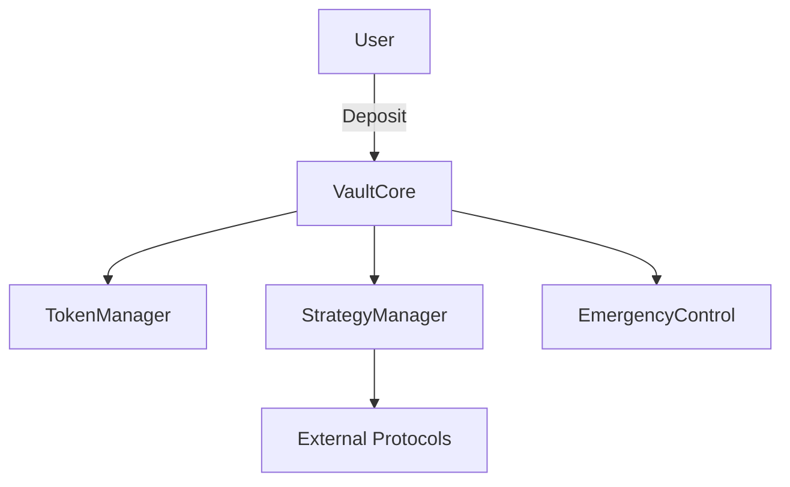

# System Design Document

## 1. Overview

The Multi-Token DeFi Vault is designed as a modular and secure vault contract supporting:
- Multi-token management
- Strategy integrations with external DeFi protocols
- Emergency and access control features

---

## 2. Architecture

**Main Components**
- **VaultCore.sol**: Primary interface for users (deposit, withdraw, query)
- **TokenManager.sol**: Handles ERC20 registration, transfers, and balances
- **StrategyManager.sol**: Defines how funds interact with external protocols
- **EmergencyControl.sol**: Provides pause and recovery functionality
- **AccessControl.sol**: Role-based permissions for admins/operators

---

## 3. Contract Interactions

---

## 4. Data Flow

1. User deposits ERC20 tokens into the vault  
2. Vault records token balances via `TokenManager`  
3. Funds may be allocated to strategies for yield farming  
4. Admin/operator can pause or recover assets in emergencies  
5. Withdrawals are processed securely with balance verification

---

## 5. Future Improvements
- Integration with cross-chain bridges
- On-chain governance and DAO voting
- Automated strategy optimization
